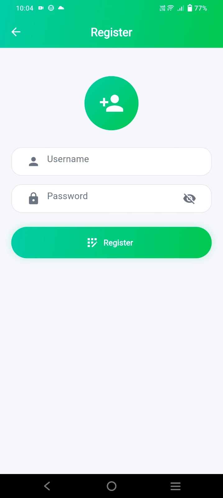
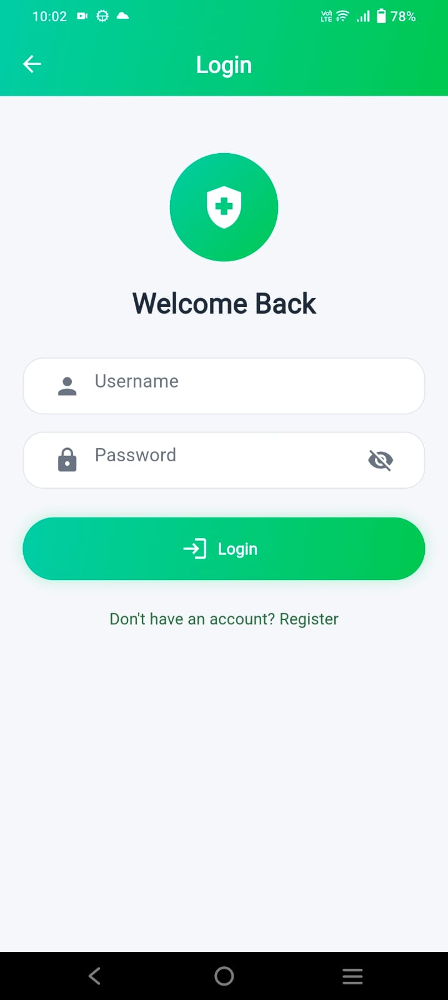
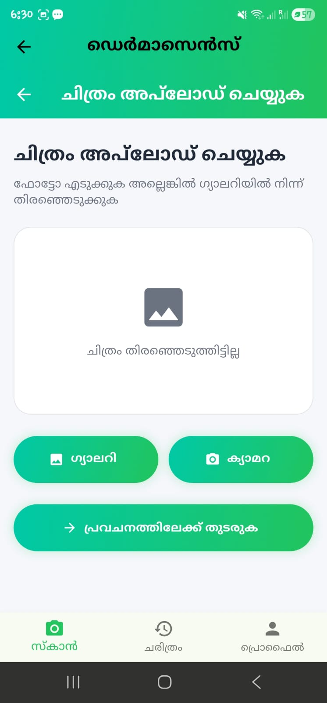
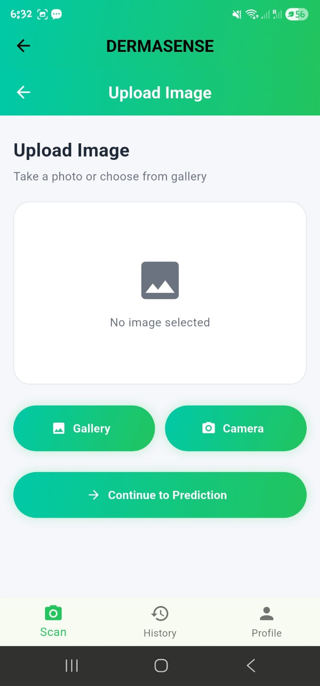
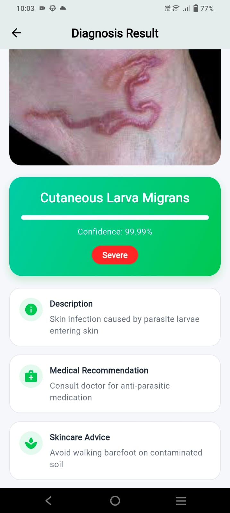
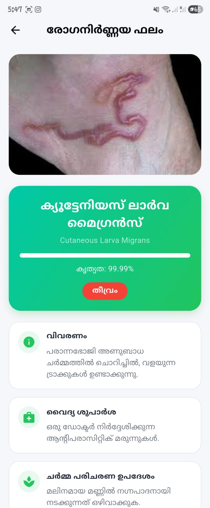
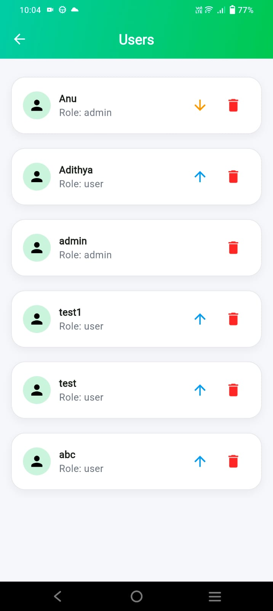
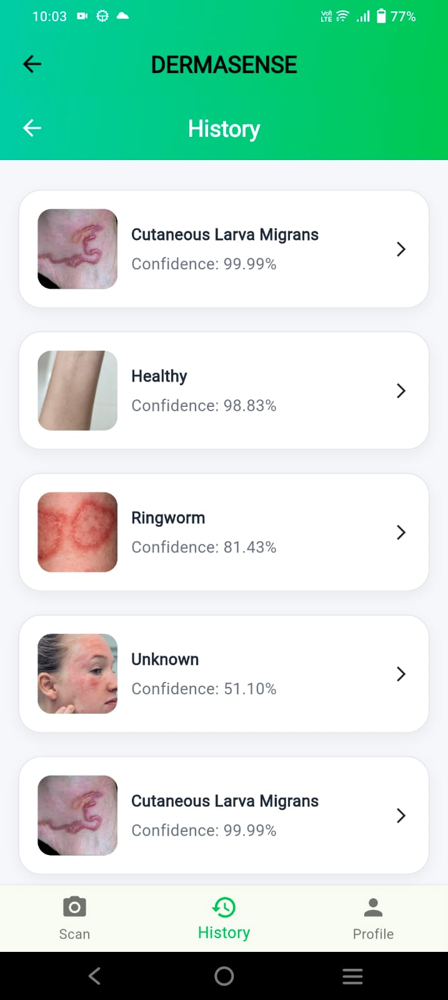
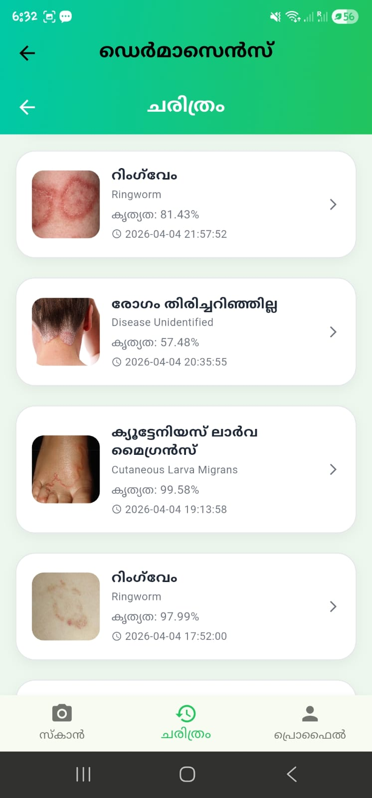

# DermaSense — Skin Disease Detection App

DermaSense is an AI-powered cross-platform mobile application developed using **Flutter** and **TensorFlow** for automated skin disease detection. The application uses a **MobileNetV2** transfer learning model to analyze skin images and predict possible skin conditions with confidence scores. It also provides secure user authentication, multilingual support, prediction history, and an admin dashboard for managing users and disease information.

> **Final-Year B.Tech Computer Science & Engineering Academic Project**  
> Developed by a team of four students.

---

## Table of Contents

- [Features](#features)
- [Tech Stack](#tech-stack)
- [Architecture](#architecture)
- [Project Structure](#project-structure)
- [Getting Started](#getting-started)
- [API Reference](#api-reference)
- [Model Details](#model-details)
- [Screenshots](#screenshots)
- [Known Repository Issues](#known-repository-issues)
- [Future Enhancements](#future-enhancements)
- [Contributors](#contributors)
- [License](#license)

---

# Features

## User Features

- Secure user registration and login
- Upload or capture skin images for disease detection
- AI-powered disease prediction with confidence score
- Prediction history with delete functionality
- English and Malayalam language support
- Role-based navigation

## Admin Features

- View and manage users
- Promote or demote users
- Delete users
- View all prediction history
- Manage disease information database

---

# Tech Stack

| Layer | Technology |
|-------|------------|
| Mobile Application | Flutter (Dart) |
| Machine Learning | TensorFlow, Keras, MobileNetV2 |
| Image Processing | OpenCV |
| Local Storage | SQLite (`sqflite`) |
| Networking | HTTP, Dio |
| Localization | Flutter Intl |
| Backend | REST API |

---

# Architecture

```
             Flutter Mobile App
                    │
                    │ REST API
                    ▼
              Backend Server
                    │
                    ▼
      MobileNetV2 Deep Learning Model
                    │
                    ▼
          Disease Prediction Result
```

### Workflow

1. User uploads or captures a skin image.
2. The image is sent to the backend.
3. The backend preprocesses the image.
4. The MobileNetV2 model predicts the disease.
5. The predicted disease and confidence score are returned.
6. The prediction is stored in the user's history.

---

# Project Structure

```text
Skin_App/
│
├── README.md
├── screenshots/
│   ├── login.jpeg
│   ├── register.jpeg
│   ├── home.jpeg
│   ├── predict.jpeg
│   ├── result.jpeg
│   ├── disease_detail.jpeg
│   ├── history.jpeg
│   ├── home_malayalam.jpeg
│   ├── admin_users.jpeg
│   └── admin_diseases.jpeg
│
└── Skin_App-main/
    └── skindisease/
        ├── skin_app/
        ├── skin_disease_ai/
        └── backend/
```

---

# Getting Started

## Prerequisites

- Flutter SDK 3.x
- Android Studio or VS Code
- Python 3.11+
- Git

---

## Clone Repository

```bash
git clone https://github.com/adithyams20/Skin_App.git
```

---

## Run Flutter Application

```bash
cd Skin_App/Skin_App-main/skindisease/skin_app

flutter pub get

flutter run
```

---

## Train the AI Model

```bash
cd Skin_App/Skin_App-main/skindisease/skin_disease_ai

pip install -r requirements.txt

python model/train.py
```

---

## Run Prediction

```bash
python model/predict.py --image path/to/image.jpg
```

---

# API Reference

| Endpoint | Method | Description |
|-----------|--------|-------------|
| `/login` | POST | User Login |
| `/register` | POST | Register User |
| `/change_password` | PUT | Change Password |
| `/predict` | POST | Predict Disease |
| `/history` | GET | User Prediction History |
| `/history/delete` | DELETE | Delete Prediction History |
| `/admin/users` | GET | View Users |
| `/admin/delete_user` | DELETE | Delete User |
| `/admin/promote_user` | PUT | Promote User |
| `/admin/demote_user` | PUT | Demote User |
| `/admin/history` | GET | View Prediction History |
| `/admin/delete_prediction` | DELETE | Delete Prediction |
| `/admin/diseases` | GET | View Disease Information |
| `/admin/update_disease` | PUT | Update Disease Information |

---

# Model Details

- **Architecture:** MobileNetV2 Transfer Learning
- **Framework:** TensorFlow / Keras
- **Image Processing:** OpenCV
- **Output:** Disease Prediction with Confidence Score

### Model Files

- `skin_disease_model.h5`
- `class_indices.json`

> **Disclaimer**  
> This application is developed solely for academic and educational purposes. It is **not** a certified medical device and should not be used as a substitute for professional medical diagnosis.

---

# Screenshots

## Login & Registration

| Login | Register |
|-------|----------|
|  |  |

---

## Home & Prediction

| Home | Prediction |
|------|------------|
|  |  |

---

## Result & Disease Details

| Prediction Result | Disease Details |
|-------------------|-----------------|
|  |  |

---

## History & Malayalam Interface

| History | Malayalam Home |
|---------|----------------|
|  |  |

---

## Admin Module

| Manage Users | Manage Diseases |
|--------------|-----------------|
|  |  |

---

# Known Repository Issues

- The backend source code is partially available.
- The trained AI model and dataset are directly committed to the repository.
- A `requirements.txt` file for the AI module is not included.
- Generated cache files and temporary files should be ignored using `.gitignore`.

---

# Future Enhancements

- Complete backend integration
- Cloud deployment using Docker
- Continuous Integration using GitHub Actions
- Explainable AI using Grad-CAM
- Support additional skin diseases
- Improve prediction accuracy using larger datasets
- Cross-platform deployment for Android and iOS

---


